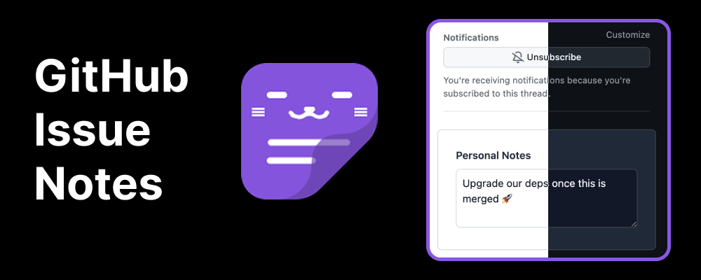
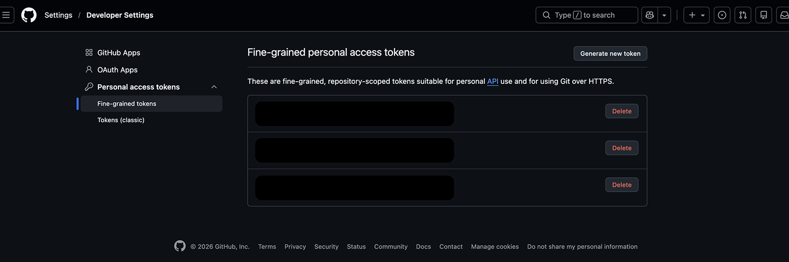
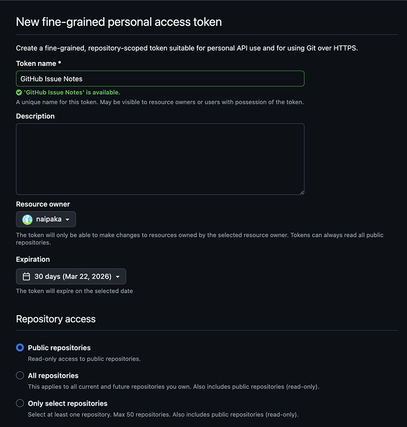
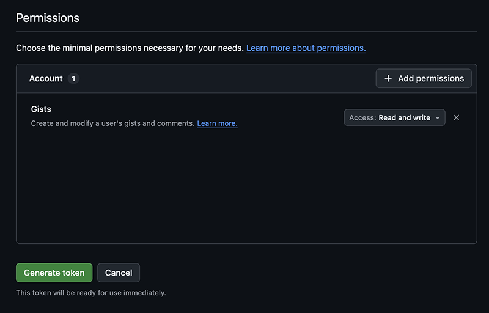
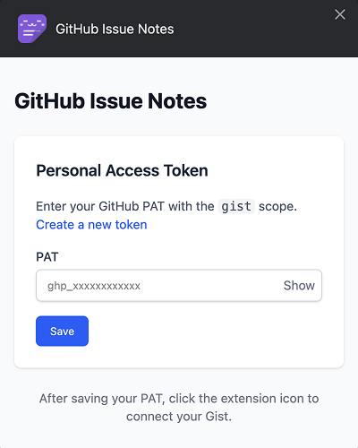
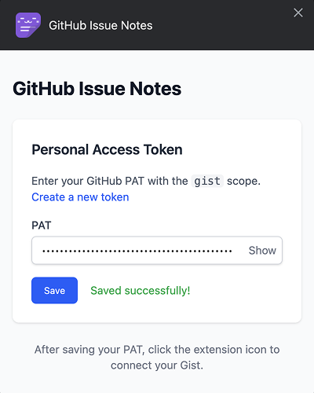
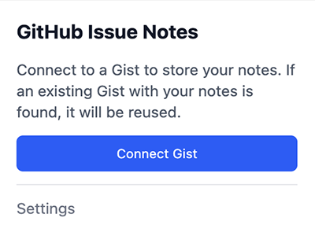
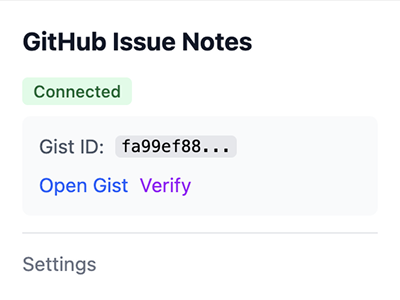
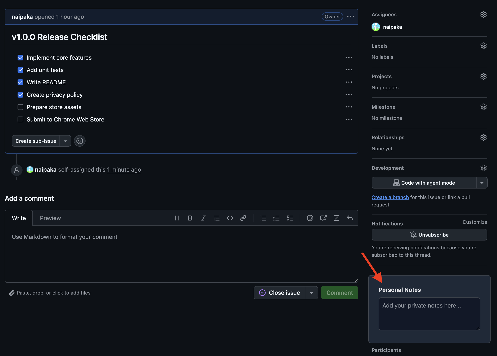
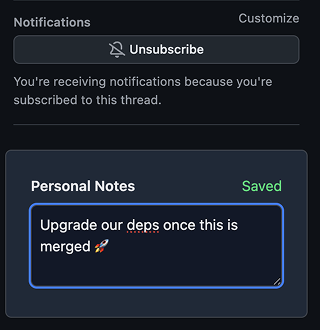

# GitHub Issue Notes

[](https://opensource.org/licenses/MIT)
<!-- [](https://chrome.google.com/webstore/detail/EXTENSION_ID) -->

Add personal notes to GitHub Issues and Pull Requests. Notes are saved to your private Gist and synced across devices.



## Features

- **Personal Notes on Issues/PRs** - Add private notes directly on GitHub Issue and PR pages
- **Private Gist Storage** - Notes are saved to your own GitHub Private Gist (only you can access)
- **Auto-save** - Notes are automatically saved as you type (1 second debounce)
- **Dark Mode Support** - Seamlessly adapts to GitHub's dark mode
- **Cross-device Sync** - Access your notes from any device via Gist

## Installation

### Chrome Web Store (Coming Soon)

<!-- [Install from Chrome Web Store](https://chrome.google.com/webstore/detail/EXTENSION_ID) -->

### Development Version

1. Clone this repository
   ```bash
   git clone https://github.com/YOUR_USERNAME/github-issue-notes.git
   cd github-issue-notes
   ```

2. Install dependencies
   ```bash
   pnpm install
   ```

3. Build the extension
   ```bash
   pnpm build
   ```

4. Load in Chrome
   - Open `chrome://extensions/`
   - Enable "Developer mode"
   - Click "Load unpacked"
   - Select the `.output/chrome-mv3` folder

## Usage

### Step 1: Get a GitHub Personal Access Token (PAT)

1. Go to **GitHub Settings** → **Developer settings** → **Personal access tokens** → **Fine-grained tokens**
   - Direct link: https://github.com/settings/personal-access-tokens/new



2. Configure the token:
   - **Token name**: `GitHub Issue Notes` (or any name you prefer)
   - **Expiration**: Choose your preferred expiration
   - **Repository access**: Select **"Public Repositories (read-only)"** (Gists don't require repo access)
   - **Account permissions**: Expand and set **Gists** to **"Read and write"**



3. Click **"Generate token"** and **copy the token** (you won't see it again!)



> **Note**: Classic tokens with `gist` scope also work if you prefer.

### Step 2: Configure the Extension

1. Click the extension icon in Chrome toolbar, then click **"Open Settings"**
   - Or right-click the extension icon → **"Options"**



2. Paste your PAT and click **"Save"**



### Step 3: Connect Gist

1. Click the extension icon to open the popup
2. Click **"Connect Gist"**



3. Once connected, you'll see **"Connected"** with a link to your Gist



> **Note**: If you already have a Gist with the file `github-issue-notes.json`, the extension will reuse it instead of creating a new one.

### Step 4: Start Taking Notes!

1. Navigate to any GitHub Issue or PR page
2. Find the **"Personal Notes"** section in the sidebar (below Notifications)



3. Type your notes - they **auto-save** after 1 second of inactivity
4. You'll see **"Saving..."** then **"Saved"** to confirm



## Permissions

| Permission | Purpose |
|------------|---------|
| `storage` | Store your PAT and Gist ID locally in your browser |
| `host_permissions` (api.github.com) | Access GitHub Gist API to read/write your notes |

**Note**: Your PAT is stored locally and is only sent to GitHub's official API. It is never exposed to web pages or third parties.

## Privacy

- **PAT**: Stored locally in your browser, never sent to any server except GitHub API
- **Notes**: Stored in your private GitHub Gist (only you can access)
- **No Analytics**: This extension does not collect any usage data
- **No Tracking**: We don't track which Issues/PRs you visit

See [PRIVACY.md](PRIVACY.md) for the full privacy policy.

## FAQ

### Why do I need a Personal Access Token?

The extension needs to access the GitHub Gist API to store your notes. GitHub requires authentication for this, and a PAT with Gists read/write permission is the minimal permission needed.

### Where are my notes stored?

Your notes are stored in a **private Gist** in your GitHub account. You can view and edit this Gist directly at https://gist.github.com. The file is named `github-issue-notes.json`.

### Can others see my notes?

No. The Gist is created as **private**, which means only you can see it when logged into your GitHub account.

### What happens if I uninstall the extension?

Your notes remain in your GitHub Gist. If you reinstall the extension and reconnect with the same GitHub account, your notes will be restored.

### Does it work on GitHub Enterprise?

Not currently. The extension only supports github.com.

## Development

### Tech Stack

- [WXT](https://wxt.dev/) - Web Extension Framework
- [React](https://react.dev/) - UI Library
- [TypeScript](https://www.typescriptlang.org/) - Type Safety
- [Tailwind CSS v4](https://tailwindcss.com/) - Styling

### Commands

```bash
pnpm dev          # Start development server (Chrome)
pnpm dev:firefox  # Start development server (Firefox)
pnpm build        # Production build
pnpm compile      # TypeScript type check
pnpm test         # Run tests
pnpm zip          # Create ZIP for store submission
```

### Project Structure

```
entrypoints/
├── background.ts   # Service Worker - Gist API communication
├── content.tsx     # Content Script - Injects UI into GitHub pages
├── options/        # Options page - PAT management
└── popup/          # Popup - Gist connection

components/
└── NoteArea.tsx    # Note input component

utils/
├── messaging.ts    # Type-safe messaging between scripts
├── storage.ts      # Chrome storage wrapper
├── gist.ts         # GitHub Gist API client
└── notes.ts        # Notes data management
```

## Contributing

Contributions are welcome! Please open an issue or pull request.

## License

[MIT](LICENSE)
